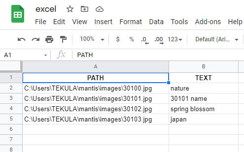

# mantis


standalone application to edit images in bulk fetched from an xlsx file

ui is created using [gooey](https://github.com/chriskiehl/Gooey) and built, tested on windows

### run the application

- find the `mantis.exe` file in the `dist/` folder
- it is a windows executable, double click on it to start the application

### install dev mode

clone and open the repo in command prompt
```
C:\Users\TEKULA>git clone https://github.com/vtekula/mantis
C:\Users\TEKULA>cd mantis
```

create a virtual environment
```
C:\Users\TEKULA\mantis>mkdir venv
C:\Users\TEKULA\mantis>python -m venv venv
C:\Users\TEKULA\mantis>venv\Scripts\activate.bat
(venv) C:\Users\TEKULA\mantis>
```

install the requirements and launch the application
```
(venv) C:\Users\TEKULA\mantis>pip install -r requirements.txt
(venv) C:\Users\TEKULA\mantis>python mantis.py
```

### generate windows executable

- for packaging gooey applications, `pyinstaller` should be used
- you need `build.spec` configuration, created one for mantis
- the process is well-explained in the [official documentation](https://github.com/chriskiehl/Gooey/blob/master/docs/packaging/Packaging-Gooey.md)
```
(venv) C:\Users\TEKULA\mantis>pip install pyinstaller
(venv) C:\Users\TEKULA\mantis>pyinstaller -F --windowed build.spec
```

after some time, you can find the `.exe` file in the `dist/` folder

### demo and pictures

look of the application


excel sheet format



result

| original image | edited with `mantis` tool |
| --- | --- |
|  |  |

### credits

this was made as a freelance project and the development of this tool is funded by Niraj T
